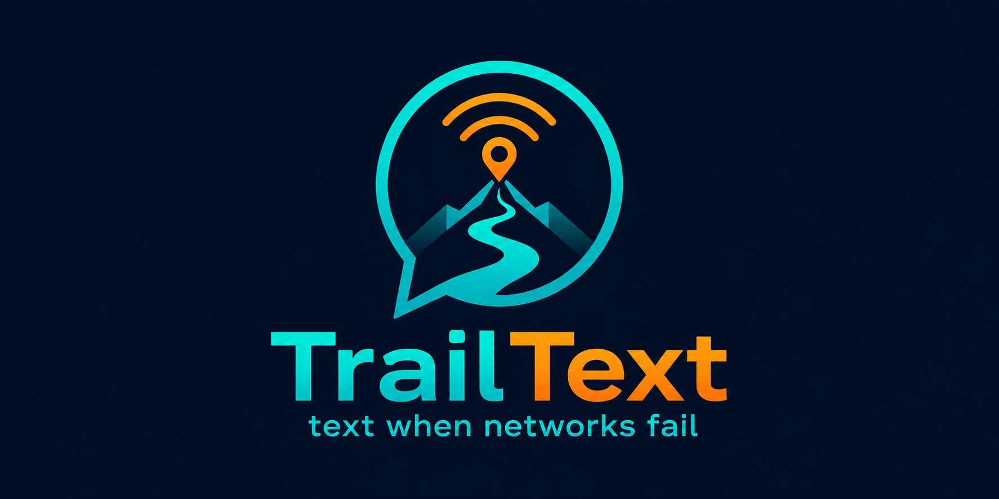
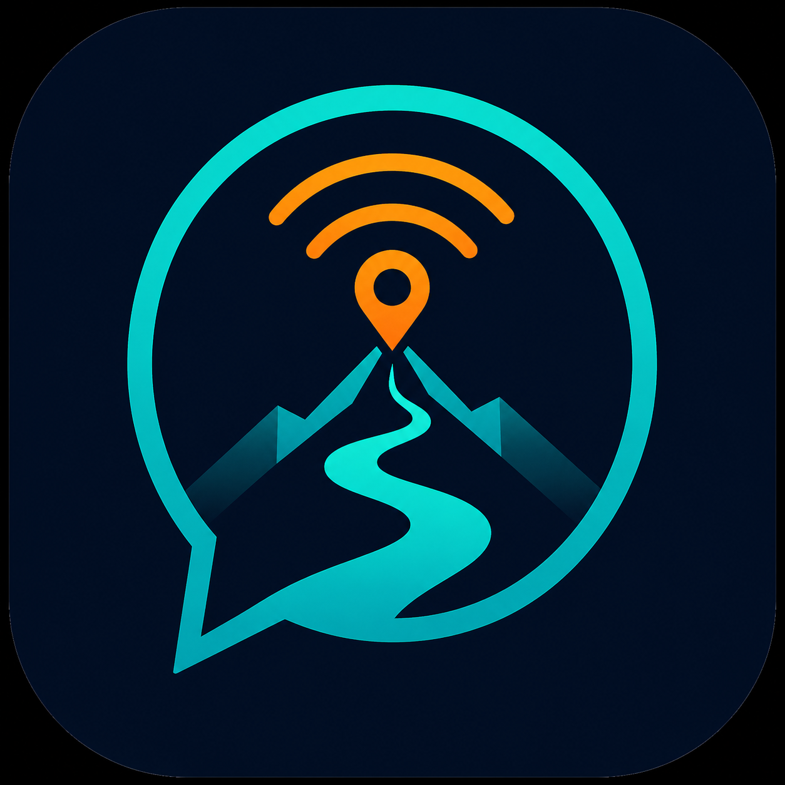
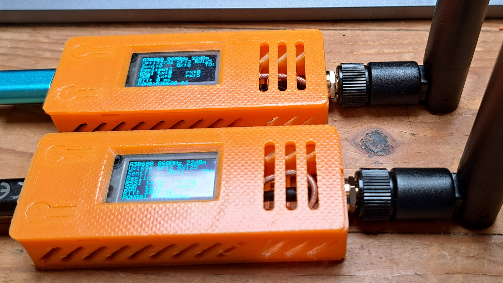
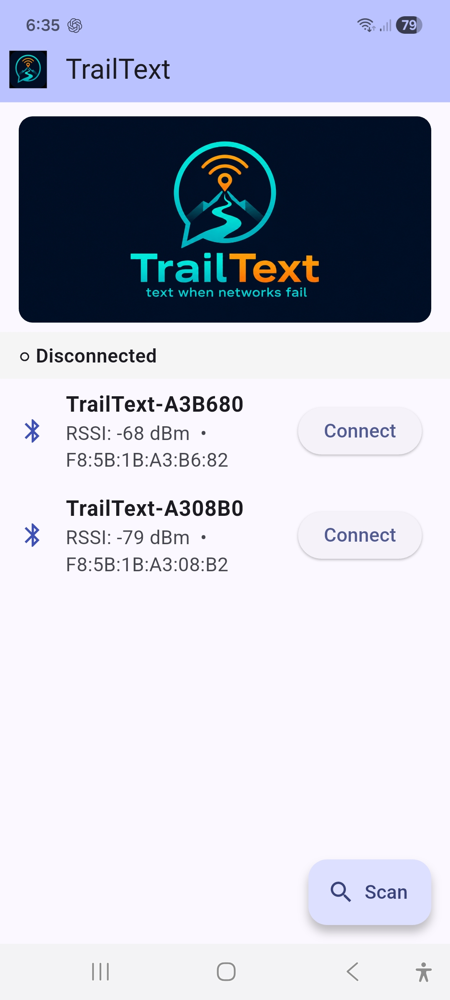
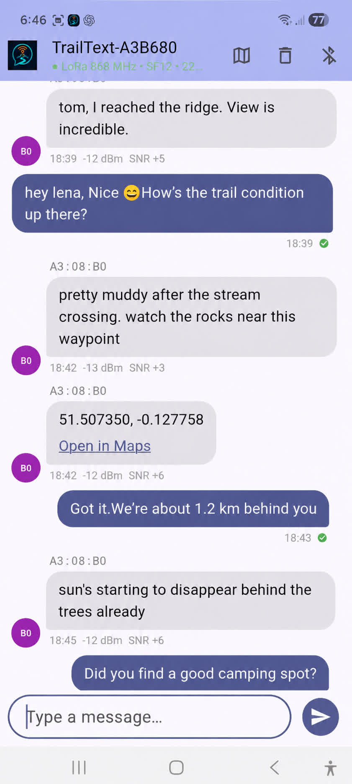

<p align="center">
  
</p>

<h1 align="center">LoRa Experiments for Heltec WiFi LoRa 32</h1>

<p align="center">
  <strong>Two practical ESP32-S3 + SX1262 projects for testing LoRa links and sending text when normal networks are unavailable.</strong>
</p>

<p align="center">
  
  
  
  
</p>

## Projects

<table>
  <tr>
    <td width="22%" align="center">
      
    </td>
    <td>
      <h3>TrailText</h3>
      <p><strong>Text when networks fail.</strong></p>
      <p>
        A BLE-to-LoRa messenger for Heltec WiFi LoRa 32 V4.3 boards.
        A phone connects over BLE, the ESP32 encrypts the message with AES-256-GCM,
        and the SX1262 radio carries it over LoRa to another device.
      </p>
      <p>
        <a href="lora-text/firmware/README.md">Firmware guide</a>
        &nbsp;|&nbsp;
        <a href="lora-text/app/README.md">Flutter app guide</a>
        &nbsp;|&nbsp;
        <a href="lora-text/firmware/main/main.c">Firmware source</a>
      </p>
    </td>
  </tr>
  <tr>
    <td width="22%" align="center">
      <strong>LoRa<br>Ping-Pong</strong>
    </td>
    <td>
      <h3>LoRa Ping-Pong</h3>
      <p><strong>A simple range, antenna, and radio sanity test.</strong></p>
      <p>
        Flash the same firmware to two Heltec boards, press the user button,
        and measure round-trip time, RSSI, and SNR. It is the fastest way to
        prove the radio path before moving on to encrypted messaging.
      </p>
      <p>
        <a href="lora-ping-pong/README.md">Ping-Pong guide</a>
        &nbsp;|&nbsp;
        <a href="lora-ping-pong/main/main.c">Firmware source</a>
      </p>
    </td>
  </tr>
</table>

## LoRa Ping-Pong Hardware

<p align="center">
  
</p>

## TrailText Screenshots

<p align="center">
  
  &nbsp;&nbsp;&nbsp;
  
</p>

## What This Repo Gives You

| Area | TrailText | LoRa Ping-Pong |
|------|-----------|----------------|
| Purpose | Encrypted off-grid text messaging | Link/range test between two boards |
| Hardware | Heltec WiFi LoRa 32 V4.3, ESP32-S3 + SX1262 | Heltec WiFi LoRa 32 V4, ESP32-S3 + SX1262 |
| Radio | LoRa 868 MHz EU defaults | LoRa 868 MHz EU defaults |
| Phone app | Flutter app over BLE | Not required |
| Security | AES-256-GCM over LoRa with shared PSK | Plain diagnostic packets |
| Display | OLED status and message feedback | OLED RTT/RSSI/SNR feedback |

## Color Palette

The visual identity follows the TrailText logo: deep night blue for the field,
cyan for the radio trail, and orange for location/signal accents.

<table>
  <tr>
    <th>Color</th>
    <th>Use</th>
    <th>Hex</th>
  </tr>
  <tr>
    <td bgcolor="#001B36">&nbsp;&nbsp;&nbsp;&nbsp;</td>
    <td>Night background</td>
    <td><code>#001B36</code></td>
  </tr>
  <tr>
    <td bgcolor="#00CFC8">&nbsp;&nbsp;&nbsp;&nbsp;</td>
    <td>TrailText cyan</td>
    <td><code>#00CFC8</code></td>
  </tr>
  <tr>
    <td bgcolor="#FF9F1C">&nbsp;&nbsp;&nbsp;&nbsp;</td>
    <td>Signal orange</td>
    <td><code>#FF9F1C</code></td>
  </tr>
</table>

## Recommended Path

1. Start with [LoRa Ping-Pong](lora-ping-pong/README.md) to confirm both boards, antennas, pins, frequency, and range.
2. Flash [TrailText firmware](lora-text/firmware/README.md) once the radio link is known-good.
3. Build the [TrailText Flutter app](lora-text/app/README.md), connect over BLE, and send messages over LoRa.

## Hardware Notes

| Item | Notes |
|------|-------|
| Boards | Heltec WiFi LoRa 32 V4 / V4.3 |
| MCU | ESP32-S3 |
| Radio | SX1262 |
| Region defaults | 868 MHz EU |
| Display | On-board OLED |
| Antenna | Attach before powering or transmitting |

> Always attach the antenna before powering a LoRa board. Transmitting without an antenna can damage the SX1262 radio front end.

## Repository Layout

```text
lora-ping-pong/          Range and radio link test firmware
lora-text/firmware/      TrailText ESP-IDF firmware
lora-text/app/           TrailText Flutter app source
lora-text/app/src/assets/images/
                          TrailText PNG logo assets
LICENSE.txt              Creative Commons BY-NC-SA 4.0 notice
```

## License

(C)2026 Bruno Keymolen bruno.keymolen@gmail.com

TrailText and the source in this repository are licensed under
Creative Commons Attribution-NonCommercial-ShareAlike 4.0 International.

See [LICENSE.txt](LICENSE.txt) and
[creativecommons.org/licenses/by-nc-sa/4.0/](https://creativecommons.org/licenses/by-nc-sa/4.0/).
